# Phase 1 PRD: VEED Video Library Dashboard
*Architecture & Technical Specification*

## 📋 Project Overview

**Objective**: Build a full-stack Video Library Dashboard that enables users to browse, filter, sort, and create video entries with a focus on clean architecture, type safety, and excellent user experience.

**Time Constraint**: 4 hours total development time
**Tech Stack**: React + TypeScript (Frontend) | Node.js + Express + TypeScript (Backend)

---

## 🏗️ System Architecture

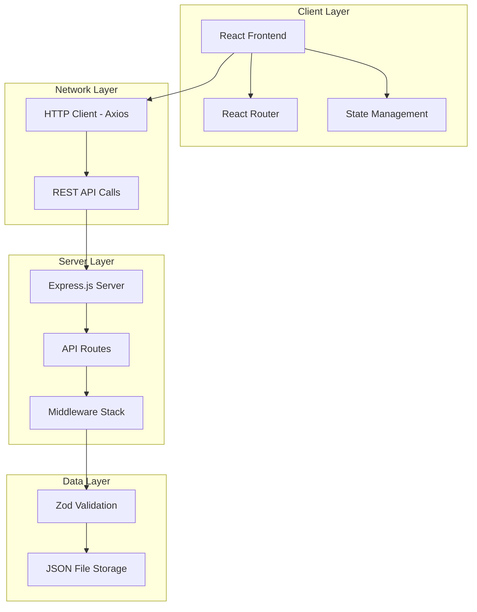

---

## 🎯 Frontend Architecture (React + TypeScript)

### Component Hierarchy

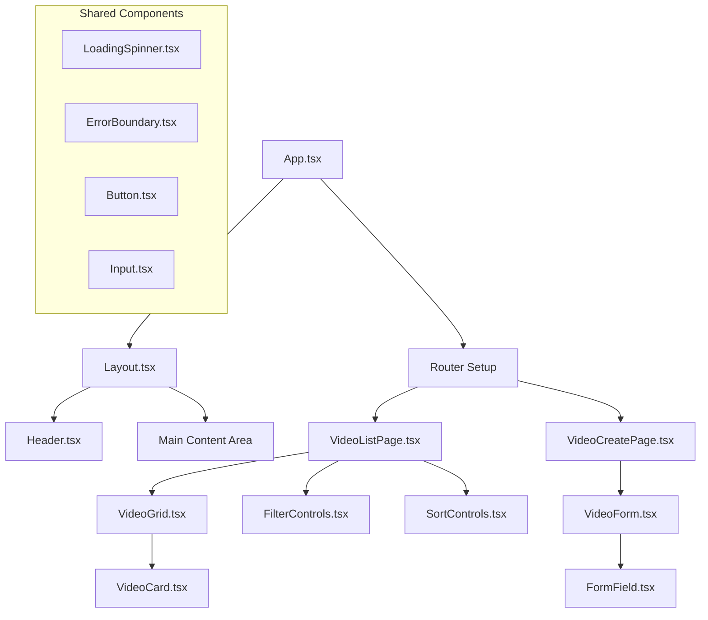

### Frontend Directory Structure

```
frontend/
├── public/
│   ├── index.html
│   └── favicon.ico
├── src/
│   ├── components/           # Reusable UI components
│   │   ├── ui/              # Basic UI elements
│   │   │   ├── Button.tsx
│   │   │   ├── Input.tsx
│   │   │   ├── LoadingSpinner.tsx
│   │   │   └── ErrorMessage.tsx
│   │   ├── layout/          # Layout components
│   │   │   ├── Header.tsx
│   │   │   ├── Layout.tsx
│   │   │   └── Navigation.tsx
│   │   └── video/           # Video-specific components
│   │       ├── VideoCard.tsx
│   │       ├── VideoGrid.tsx
│   │       ├── VideoForm.tsx
│   │       ├── FilterControls.tsx
│   │       └── SortControls.tsx
│   ├── pages/               # Page components
│   │   ├── VideoListPage.tsx
│   │   ├── VideoCreatePage.tsx
│   │   └── NotFoundPage.tsx
│   ├── hooks/               # Custom React hooks
│   │   ├── useVideos.ts
│   │   ├── useVideoMutations.ts
│   │   └── useLocalStorage.ts
│   ├── services/            # API services
│   │   ├── api.ts
│   │   ├── videoService.ts
│   │   └── types.ts
│   ├── utils/               # Utility functions
│   │   ├── formatters.ts
│   │   ├── validators.ts
│   │   └── constants.ts
│   ├── styles/              # Global styles
│   │   ├── globals.css
│   │   └── tailwind.css
│   ├── App.tsx
│   ├── index.tsx
│   └── types/               # TypeScript definitions
│       ├── video.types.ts
│       ├── api.types.ts
│       └── common.types.ts
├── package.json
├── tsconfig.json
├── tailwind.config.js
└── vite.config.ts
```

### State Management Strategy

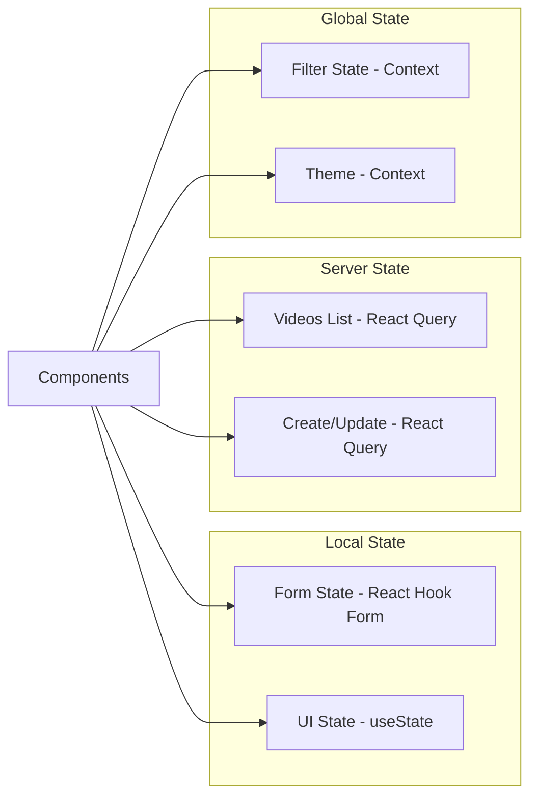

---

## ⚙️ Backend Architecture (Node.js + Express)

### API Layer Design

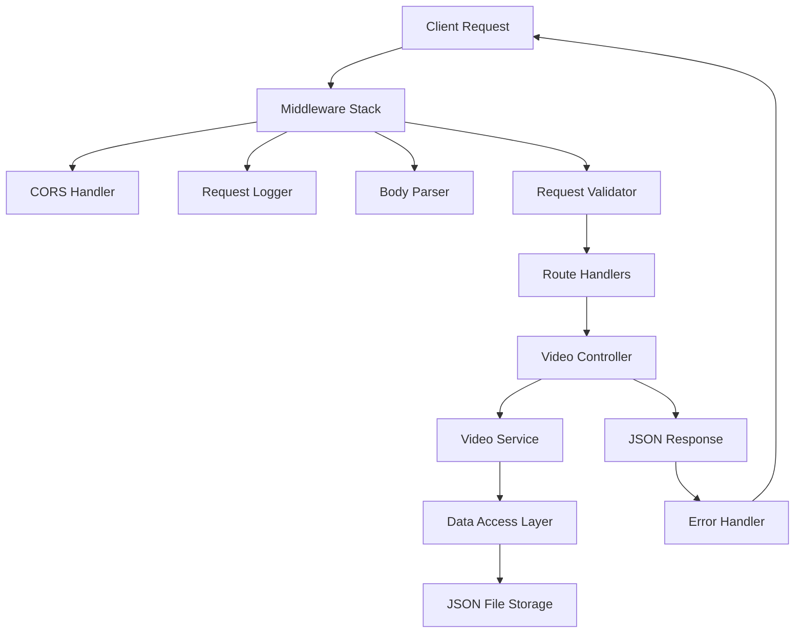

### Backend Directory Structure

```
backend/
├── src/
│   ├── controllers/         # Request handlers
│   │   ├── videoController.ts
│   │   └── healthController.ts
│   ├── services/            # Business logic
│   │   ├── videoService.ts
│   │   └── validationService.ts
│   ├── models/              # Data models
│   │   ├── Video.ts
│   │   └── types.ts
│   ├── routes/              # API routes
│   │   ├── index.ts
│   │   ├── videos.ts
│   │   └── health.ts
│   ├── middleware/          # Custom middleware
│   │   ├── errorHandler.ts
│   │   ├── validator.ts
│   │   └── logger.ts
│   ├── utils/               # Utility functions
│   │   ├── fileHandler.ts
│   │   ├── dateUtils.ts
│   │   └── responseUtils.ts
│   ├── data/                # Data storage
│   │   ├── videos.json
│   │   └── seedData.ts
│   ├── config/              # Configuration
│   │   ├── database.ts
│   │   └── environment.ts
│   ├── tests/               # Test files
│   │   ├── controllers/
│   │   ├── services/
│   │   └── utils/
│   └── app.ts               # Express app setup
├── dist/                    # Compiled JavaScript
├── package.json
├── tsconfig.json
├── jest.config.js
└── nodemon.json
```

---

## 🔌 API Specification

### Core Endpoints

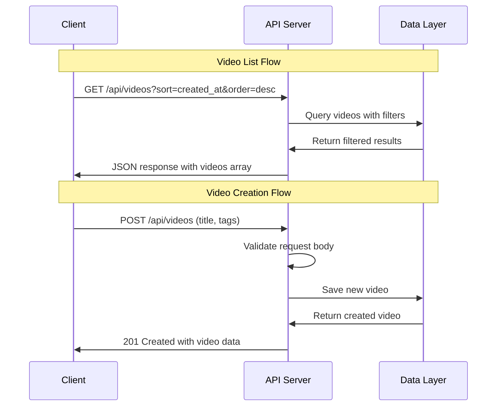

### API Routes Detail

| Method | Endpoint | Description | Query Parameters |
|--------|----------|-------------|------------------|
| GET | `/api/videos` | Get videos list | `sort`, `order`, `search`, `tags`, `limit`, `offset` |
| POST | `/api/videos` | Create new video | - |
| GET | `/api/videos/:id` | Get single video | - |
| GET | `/api/health` | Health check | - |

### Request/Response Schemas

```typescript
// GET /api/videos Response
interface VideosResponse {
  videos: Video[];
  total: number;
  page: number;
  limit: number;
}

// POST /api/videos Request
interface CreateVideoRequest {
  title: string;
  tags?: string[];
}

// Video Model
interface Video {
  id: string;
  title: string;
  thumbnail_url: string;
  created_at: string;
  duration: number;
  views: number;
  tags: string[];
}
```

---

## 🎨 UI/UX Design Principles

### Design System

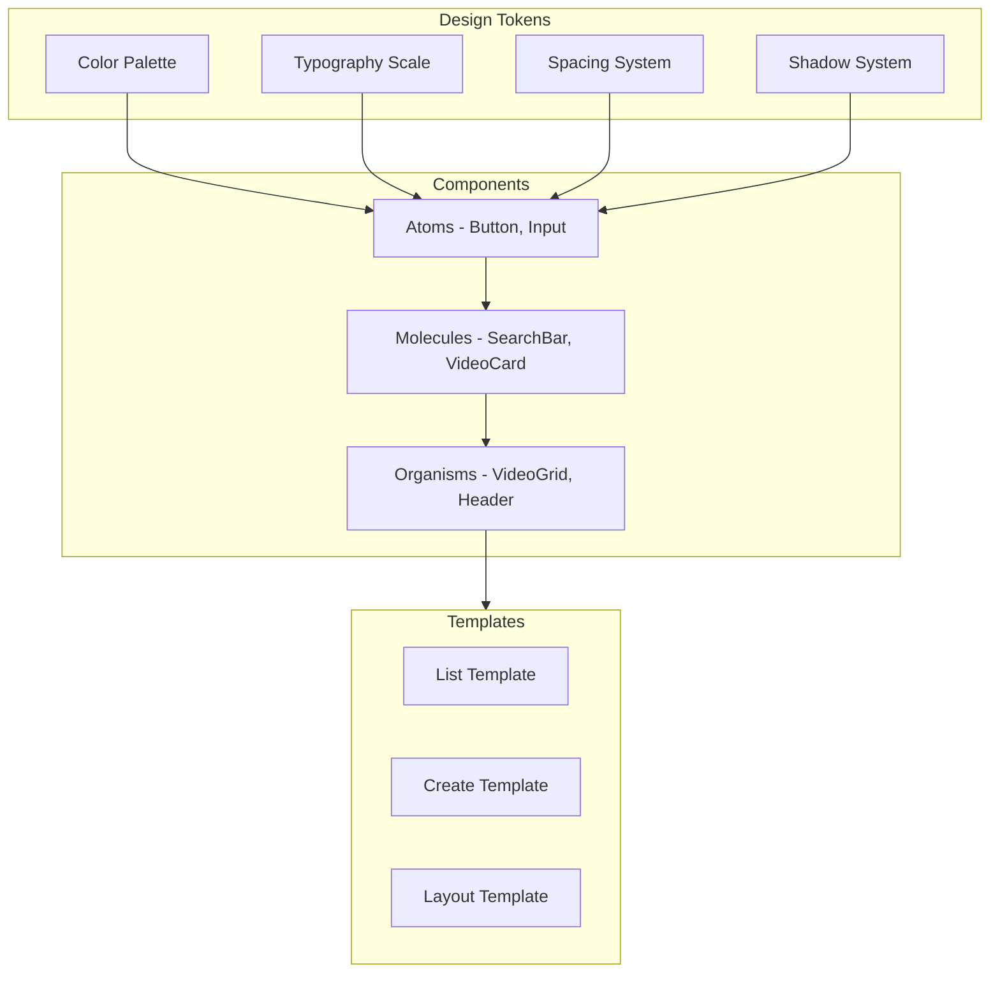

### Responsive Breakpoints

| Device | Breakpoint | Grid Columns | Card Size |
|--------|------------|--------------|-----------|
| Mobile | < 640px | 1-2 columns | Full width |
| Tablet | 640px - 1024px | 2-3 columns | Medium |
| Desktop | > 1024px | 3-4 columns | Fixed width |

---

## 🔄 Data Flow Architecture

### Video List Page Flow

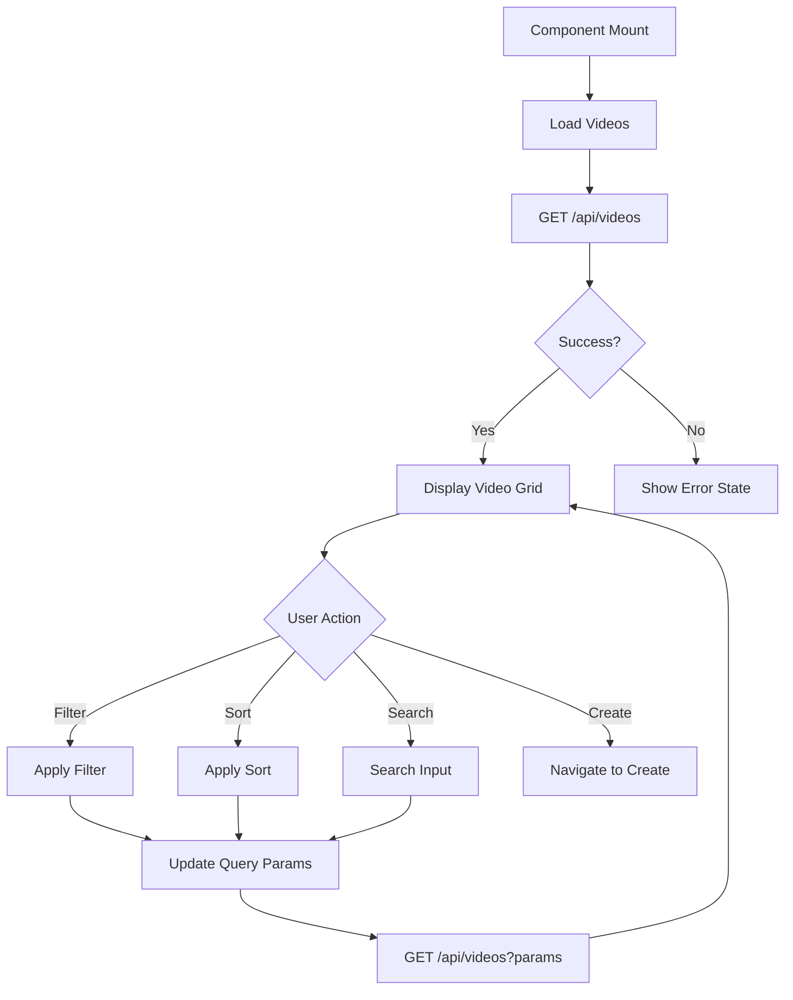

### Video Creation Flow

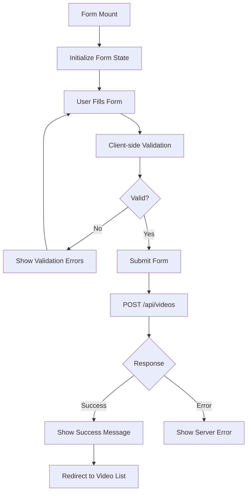

---

## 🧪 Testing Strategy

### Testing Pyramid

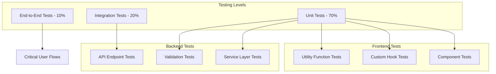

---

## 🚀 Deployment & Development

### Development Workflow

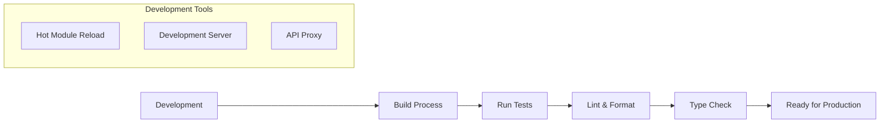

### Environment Configuration

| Environment | Frontend Port | Backend Port | Database |
|-------------|---------------|--------------|----------|
| Development | 3000 | 3001 | JSON File |
| Production | Build | 3001 | JSON File / SQLite |

---

## ⚡ Performance Considerations

### Optimization Strategy

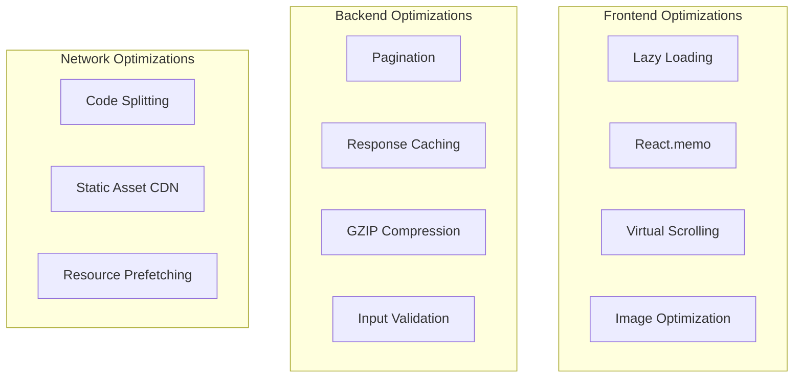

---

## 🔒 Security & Validation

### Input Validation Flow

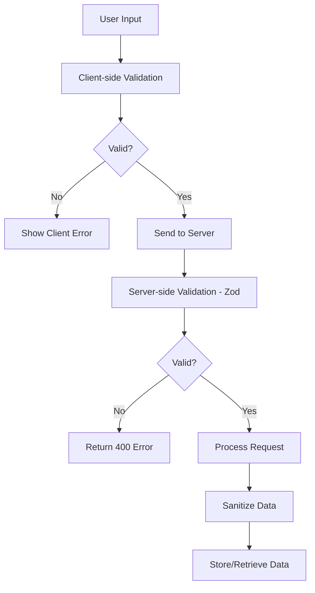

---

## 📈 Success Metrics & KPIs

### Technical Metrics
- **Performance**: Page load time < 2s, API response time < 500ms
- **Reliability**: 99.9% uptime, error rate < 1%
- **Code Quality**: TypeScript coverage > 95%, test coverage > 80%
- **Accessibility**: WCAG 2.1 AA compliance

### User Experience Metrics
- **Usability**: Task completion rate > 95%
- **Responsiveness**: Works on mobile, tablet, desktop
- **Error Handling**: Clear error messages, recovery options
- **Loading States**: Smooth loading experiences

---

## 🛣️ Implementation Roadmap

### Phase 1A: Foundation (30 minutes)
- [x] Project structure setup
- [x] Basic TypeScript configuration
- [x] Development environment setup

### Phase 1B: Backend Core (45 minutes)
- [ ] Express server with TypeScript
- [ ] API route structure
- [ ] Data seeding from videos.json
- [ ] Basic CRUD operations

### Phase 1C: Frontend Core (45 minutes)
- [ ] React app with TypeScript
- [ ] Routing setup
- [ ] Basic component structure
- [ ] API integration layer

### Phase 1D: Integration (30 minutes)
- [ ] Connect frontend to backend
- [ ] Error handling
- [ ] Loading states
- [ ] Basic testing setup

---

*This PRD serves as the technical blueprint for Phase 1 implementation, ensuring clean architecture, type safety, and scalable code structure within the 4-hour constraint.*
